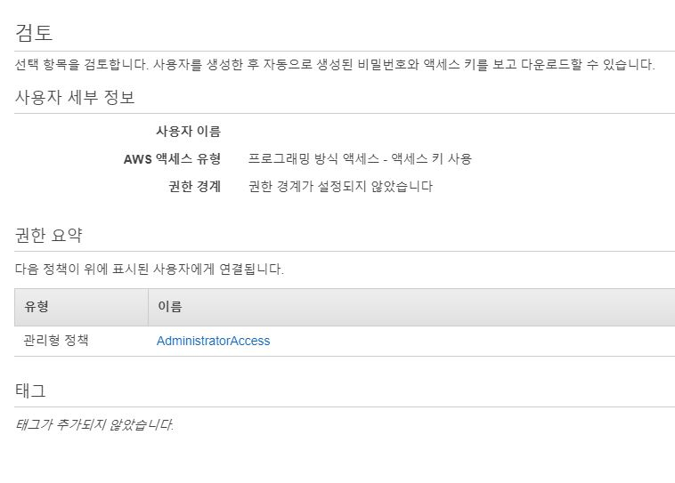
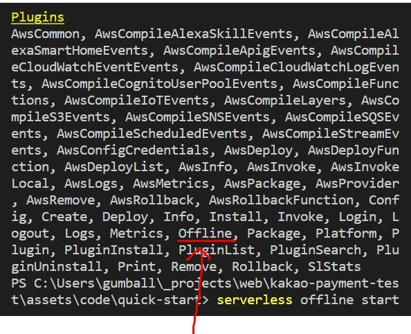

# Serverless AWS를 이용해 FaaS로 구현한 카카오 테스트 결제 서비스


'서버리스 아키텍쳐' 라는 말이 있다. 이는 서버가 없다는 의미가 아니라... 서버리스 아키텍쳐를 서비스해주는 기업에서 서버에 대해 알아서 프로비저닝 또는 유지보수를 해 주기 때문에, __서버에 대해 더 이상 신경쓰지 않아도 된다__ 는 의미로 받아들이면 된다. 다시말하자면, 서버 자체를 구현해야 했거나(IaaS, Infrastructure as a Service), 적어도 애플리케이션을 빌드해야 했던(PaaS, Platform as a Service) 기존의 방식에서 탈피해 __정말 필요한 기능에 대해서만__ 개발할 수 있도록 하는 [클라우드 컴퓨팅 서비스](https://ko.wikipedia.org/wiki/%ED%81%B4%EB%9D%BC%EC%9A%B0%EB%93%9C_%EC%BB%B4%ED%93%A8%ED%8C%85)의 종류라고 할 수 있다.

이러한 서버리스 아키텍쳐를 이용해 개발을 진행하게 되면 적은 비용으로도 아주 빠르게 최신 애플리케이션을 빌드할 수 있다.

서버리스 아키텍쳐는 서버에 대한 것들(DB, 계정 등...)을 API로 제공해주는 BaaS(Backend as a Service)와 특정 이벤트에 대해 함수를 실행하는 FaaS(Function as a Service)로 나눌 수 있는데, 우리는 이 _FaaS_ 에 대해 진행하도록 하겠다.

FaaS의 동작 방식은 정말 간단하다. 개발자가 클라우드에 어떠한 함수를 업로드하고, 특정 이벤트가 발생했을 때에만 해당 함수를 실행하며, 함수가 실행된 횟수만큼 비용을 내는 방식이다.

이 FaaS는 대다수의 공룡 기업들(MS, AWS, Google...)에서 제공하며, 우리는 이들 중 AWS의 Lambda를 이용해 서버리스 아키텍쳐를 간단히 구현해보고, 카카오톡 테스트 결제 모듈을 서버리스 아키텍쳐로 구현해보도록 하겠다.

## AWS Serverless


AWS는 Lambda와 API Gateway를 통해 서버리스 아키텍쳐를 구현할 수 있도록 하고 있다.

참고로 AWS는 [프리 티어](https://aws.amazon.com/ko/free/?awsf.Free%20Tier%20Types=categories%23featured) 라는 서비스를 제공하여 AWS의 플랫폼과 제품 및 서비스를 무료로 체험해 볼 수 있도록 한다. 여기의 모든 과정들은 (잘만 따라온다면) 프리 티어의 범주 안에 속하는 것들이니 과금의 걱정은 하지 않아도 된다.

그래도 과금이 걱정된다면 [결제 및 비용 관리](https://console.aws.amazon.com/billing/home?nc2=h_m_bc)에서 모든 청구 비용을 확인할 수도 있으니 참고하도록 한다.

### AWS Lambda


어떠한 이벤트에 대해 코드를 실행하고 컴퓨팅 리소스를 관리하는 [AWS serverless computing](https://aws.amazon.com/ko/serverless/) 서비스이다.

간단히 설명하자면 Lambda에 어떠한 함수를 작성(또는 업로드)한 뒤, API Gateway와 같은 서비스를 이용해 이벤트에 연결한다. 이후 이벤트가 트리거되는 즉시 해당 함수를 실행하는 것.

주의할 것은 Lambda가 어떠한 상태를 저장하는 것은 아니기 때문에, 값을 저장하기 위해서는 AWS DynamoDB와 같은 타 서비스를 Lambda에 연결해 사용해야 한다. 이렇게 Lambda는 AWS의 다른 서비스들과도 연결할 수 있다. 다만 이는 글의 주제와 맞지 않기 때문에, 더 알고 싶다면 [AWS Lambda 개발자 안내서](https://docs.aws.amazon.com/ko_kr/lambda/latest/dg/use-cases.html)를 참고하도록 한다.

### AWS API Gateway


개발자가 API를 생성, 게시, 유지관리, 모니터링 등을 할 수 있는 AWS 서비스이다. API Gateway를 통해 Lambda 뿐 아니라 위의 그림에서와 같이 DDB(DynamoDB), EC2, S3 등 여타 AWS 서비스들에 대해 액세스할 수 있는 endpoints를 생성할 수 있다.

이로써 다음과 같은 HTTP 요청만으로 Lambda의 함수를 실행할 수 있게 된다.

```sh
$ curl -X GET https://my-lambda-api-gateway-endpoint.com/

# 요청에 대한 응답으로 Lambda에서 실행된 함수의 값을 반환받을 수 있다.
```

이러한 서비스들을 어떻게 사용할 수 있을까. 이를 위해서는 좀 까다로운? 지식들이 선행되어야 한다.

여기서 _Serverless Framework_ 가 나온다.

## Serverless Famework


Serverless는 위와 같은 서버리스 아키텍쳐를 배포하고 운영하기 위한 [프레임워크](https://en.wikipedia.org/wiki/Software_framework)이다.

Serverless를 사용함으로써 아주 쉽고 간편하게 AWS 서버리스 아키텍쳐를 구현할 수 있다. 설치부터 시작해 하나하나 진행해보도록 하자.

### Quick start
Serverless를 설치하는 것 부터 시작해, `Hello!` 를 반환하는 서비스를 만들어보도록 하겠다.

#### 0. npm 설치
Serverless는 Node.js 런타임 환경에서 제공되는 프레임워크이기 때문에, NPM(Node Package Manager)을 통해 설치해야 한다. 만약 npm이 설치되어 있지 않다면 [이 링크](https://www.npmjs.com/get-npm)를 통해 설치를 먼저 진행하도록 하자.

설치를 마쳤으면 다음의 명령이 정상적으로 실행될 것이다.

```sh
$ node -v
# v12.14.1

$ npm -v
# 6.9.0
```

물론 버전은 달라질 수 있다. 중요한 것은 저 명령이 실행되냐는 것.

npm 설치를 마쳤다면, 다음 순서대로 serverless를 설치해보도록 하자.

#### 1. Serverless 설치
다음의 명령으로 serverless를 설치할 수 있다.

```sh
$ npm install -g serverless
```

이 명령은 global하게 serverless를 설치한다는 것을 의미한다. 이 명령을 통해 다음과 같이 커맨드 창에서 해당 모듈로 접근할 수 있게 된다. ([SO - what does the "-g" flag do in the command "npm install -g &lt;something&gt;"?](https://stackoverflow.com/a/13167605))

```sh
$ serverless create --template aws-nodejs --path my-service

# 좀 아래에서 보겠지만, serverless 프로젝트를 만드는 명령이다.
# 아직 입력은 하지 말도록 하자.
```

아무튼 설치를 마쳤다면 이제 serverless에서 AWS의 권한을 얻어야 할 차례이다.

#### 2. AWS IAM 만들기
먼저 AWS 콘솔에 로그인한다. AWS 계정이 없는 경우 생성하도록 하자.


콘솔 창의 왼쪽 상단 '서비스(Services)' 탭을 클릭 후, 다음과 같이 'IAM' 을 검색해 IAM 페이지로 들어가도록 하자.


IAM 페이지에 들어갔으면, 왼쪽 사용자 탭을 클릭한 뒤 '사용자 추가(Add User)' 버튼을 누른다.


적절한 사용자 이름을 입력한 뒤, '프로그래밍 방식 액세스(Programmatic access)'에 체크한 뒤 다음 버튼을 누른다.


'기존 정책 직접 연결(Attach existing policies directly)' 버튼을 클릭한 뒤, 나오는 목록에서 'AdministratorAccess'를 체크한 뒤 다음 버튼을 누른다.


태그는 따로 추가할 것 없다. 다음 버튼을 눌러 계속 진행해주자.



마지막으로 검토 창에서 설정한대로 계정이 만들어졌는지 검토를 한 뒤, '사용자 만들기' 버튼으로 사용자를 추가해주도록 하자.


정상적으로 사용자가 추가되었다면, 위와 같은 화면이 반겨줄 것이다. 여기서 '액세스 키 ID(Access key ID)'와 '비밀 액세스 키(Secret access key)'를 Serverless 설정에서 사용할 것이다. 각각 복사해서 메모장에 잠시 붙여넣어주도록 하자.

이 키값들은 유의해서 다뤄야 하는데, 이를 이용하여 AWS 자원을 맘대로 소모시킬 수 있기 때문. 혹여 악의적인 목적을 가진 다른 사용자로 인해 금전적인 피해를 보고 싶지 않다면 이 값들을 잘 관리하도록 하자.

참고로 Sercret access key는 __발급 시 딱 한 번만 볼 수 있기 때문에__ 주의히자. 물론 잃어버린 경우 Access key ID를 새로 발급받아 새로운 Secret access key를 발급받을 수 있다(물론 이 경우도 발급받을 때 한 번만 볼 수 있다).

#### 3. Serverless credentials 설정
Serverless에서 여러가지 작업을 하기 위한 AWS 권한을 설정해주도록 하자.

```sh
$ serverless config credentials --provider aws --key xxxxxxxxxx --secret xxxxxxxxxx
```

첫 번째 key는 Access key ID가 들어가고, 두 번째 key는 Secret access key가 들어가게 된다. 성공하게 되면 다음과 같은 로그가 출력된다.


참고로 이 명령을 통해 `~/.aws/credentials` 위치에 키값이 저장된다는 것을 알아두자. 이는 로그에도 출력된다.

이것으로 Serverless에서 AWS를 사용할 수 있는 모든 준비를 마쳤다. 이제 serverless project를 생성해보도록 하겠다.

#### 4. serverless 프로젝트 생성
프로젝트를 생성할 폴더로 명령창의 위치를 옮긴 다음(cd), 다음의 명령으로 serverless 프로젝트를 생성한다.

```sh
$ cd project-folder

$ serverless create --template aws-nodejs --path quick-start

$ cd quick-start
```

이 명령은 AWS의 서버리스 아키텍쳐 서비스를 이용할 것이며, Node.js 런타임 환경에서 Lambda의 개발을 진행할 것임을 의미한다. 참고로 명령을 입력하기 전에 프로젝트 이름인 `quick-start` 라는 이름의 폴더는 없어야만 한다.

성공적으로 프로젝트를 생성하였을 경우, 다음과 같이 나타난다.


이렇게 잘 생성되었으면 이제 해당 폴더에 어떠한 것들이 생성되었는지 보도록 하자.

#### 5. init files
다음과 같은 파일이 `quick-start` 폴더 아래에 위치하게 된다.


각각 다음과 같다. ([`.gitignore`은 git 관련 파일](https://git-scm.com/docs/gitignore))

##### `serverless.yml`
서비스의 모든 설정들이 들어있는 파일이다. 주석을 제외한 내용은 다음과 같다.

```yml
# serverless.yml

service: quick-start # service name

provider:
  name: aws # service provider
  runtime: nodejs8.10 # runtime

functions: # function lists
  hello: # function name
    handler: handler.hello # handler function (<file name>.<function name>)
```

* _service_: 서비스의 이름
* _provider_: 서버리스 아키텍쳐 서비스 제공 업체와 런타임 환경 정의
* _funcitons_: 서비스의 모든 함수들에 대한 리스트

_functions_ 프로퍼티 아래에는 구분을 위한 이름과 요청을 핸들링할 함수가 명시되어있으며, 이 곳에 _events_ 프로퍼티를 추가해 함수를 실행할 이벤트를 등록할 수 있다.

##### `handler.js`
파일을 열어보면 다음과 같다. Lambda 부분에 해당되는 함수라고 생각하면 된다.

```js
// handler.js

'use strict';

module.exports.hello = async (event, context) => {
  return {
    statusCode: 200,
    body: JSON.stringify({ // for stringify
      message: 'Go Serverless v1.0! Your function executed successfully!',
      input: event
    })
  };
};
```

* _event_: 헤더 등의 정보
* _context_: 실행되는 함수 등의 정보

`serverless.yml`의 _funcitons_ 프로퍼티에 설정했던 핸들러 함수인 `handler.js` 파일의 _hello_ 함수이다. 요청이 들어오면 이 함수가 실행된다. (말했지만 이벤트(요청) 등록은 아래에서 진행하도록 하겠다.)

반환되는 각각의 요소는 다음의 의미를 갖는다.

* _statusCode_: HTTP status code
* _body_: response body

여기서 우리는 `Hello!` 를 반환하는 서비스를 만들기로 했으니, 다음과 같이 _body_ 를 구성하여야 할 것 이다.

```js
return {
  statusCode: 200,
  body: 'Hello!'
};
```

참고로 원래 다음과 같은 callback 패턴을 사용하였으나, 1.34.0 버전에서부터 promise 패턴을 이용하여 반환할 수 있도록 구현되었다. ([Support returning promises from serverless.js](https://github.com/serverless/serverless/pull/4827))

```js
// handler.js (using callback pattern)

module.exports.hello = (event, context, callback) => {
  const response = { statusCode: 200, body: 'Hello!' };
  callback(null, response);
};
```

물론 원한다면 callback 패턴을 사용할 수도 있지만, [코드의 가독성과 간결함을 위해 promise 패턴을 사용할 수 있도록 하자.](https://medium.com/@pitzcarraldo/callback-hell-%EA%B3%BC-promise-pattern-471976ffd139)

아무튼 핸들러 함수는 모든 준비를 마쳤다. 남은 건 이제 이 함수에 대한 이벤트(요청)를 등록하는 것 뿐이다.

이는 `serverless.yml` 에 다음과 같이 _events_ 프로퍼티를 추가함으로써 가능하다.

```yml
# serverless.yml

service: quick-start

provider:
  name: aws
  runtime: nodejs8.10

functions:
  hello:
    handler: handler.hello
    events: # added
      - http:
          path: /
          method: get
```

대략 의미를 파악할 수도 있을텐데, '/' 위치에 'GET' HTTP에 대한 요청을 `handler.js` 파일의 _hello_ 함수에서 핸들링하겠다는 의미이다.

API Gateway에 대한 부분이라고 생각하면 된다. 여기서 받아들일 요청을 정의하고, 해당 요청이 들어오면 연결된 핸들러 함수를 실행하는 것이다.

#### 6. AWS에 업로드
모든 설정을 마쳤다면 이제 남은 건 AWS에 업로드 하는 것 뿐이다. 다음 명령 하나로 가능하다.

```sh
$ serverless deploy -v
```

정상적으로 deploying 되었다면 다음과 같은 로그가 출력된다.


끝에 보면 _endpoint_ 로그가 출력되는 것이 보일 것이다. 이 링크를 통해 해당 서비스의 API로 접근할 수 있다.

이게 끝이다. 얼마나 간편한가.

#### 7. Destroy projects
프로젝트를 삭제하고 싶을 때는 다음과 같은 명령만 입력하면 된다.

```sh
$ serverless remove
```

다음과 같은 로그화 함께 aws에 업로드 된 것들이 제거된다.


당연히 실제 파일은 제거되지 않기 때문에 걱정하지 말자. 다음 명령으로 언제든지 다시 deploying 할 수 있다.

```sh
$ serverless deploy -v
```

### Relieving the pain
그러나 매번 핸들러 함수를 변경할 때 마다 deploying 할 수는 없을 것이다. 이는 [serverless offline](https://github.com/dherault/serverless-offline) 플러그인을 통해 해결할 수 있다.

설치는 다음과 같다. 참고로 npm 말고 좀 더 효율적인 [yarn](https://www.vobour.com/yarn-%EC%B2%98%EC%9D%8C-%EB%B3%B4%EB%8A%94-%EC%9E%90%EB%B0%94%EC%8A%A4%ED%81%AC%EB%A6%BD%ED%8A%B8%EC%9D%98-%EC%83%88-%ED%8C%A8%ED%82%A4%EC%A7%80-%EB%A7%A4%EB%8B%88%EC%A0%80-yarn-fir)을 사용할 수도 있지만, 이는 글의 주제에서 벗어난다고 생각되어 그냥 위에서도 사용했던 npm으로 설치를 진행하도록 하겠다.

#### 1. init npm
해당 프로젝트 폴더(위의 예제에서는 `quick-start` 폴더가 될 것이다.)로 들어간 뒤 다음의 명령으로 _npm_ 사용을 위한 초기화를 진행하자.

```sh
# yarn을 사용할 수도 있으나, 여기서는 npm을 사용하도록 하겠음
$ npm init
```

명령 입력 시 프로젝트에 대한 정보를 입력해야 한다. 이는 [여기에 잘 정리되어 있으니](http://visualize.tistory.com/473) 참고하도록 한다.

#### 2. install serverless-offline
다음으로 _serverless-offline_ 모듈을 설치한다.

```sh
$ npm install serverless-offline --save-dev
```

_`--save-dev`_ 옵션은 개발 시에만 사용되는 모듈임을 명시한다. 이 옵션을 사용하면 build 시에는 해당 모듈이 포함되지 않아 좀 더 가벼운 서비스를 만들 수 있다. ([SO - What is the difference between --save and --save-dev?](https://stackoverflow.com/a/42206389))

#### 3. Serverless configuration
다음으로 `serverless.yml`에 해당 모듈을 플러그인으로 사용한다고 명시해줘야 한다.

```yml
service: quick-start

provider:
  name: aws
  runtime: nodejs8.10

plugins: # added
  - serverless-offline

functions:
  hello:
    handler: handler.hello
    events:
      - http:
          path: /
          method: get
```

#### 4. run it locally
이제 남은 건 로컬에서 실행하는 것 뿐이다. 먼저 플러그인의 초기화를 위해 다음의 명령을 입력해준다.

```sh
$ serverless
```

입력하면 다음의 로그가 출력된다.



정상적으로 플러그인이 등록되었을 시, 위의 사진에 나와있는 것 처럼 `Offline` 이라는 글자가 출력된다.

이제 다음 명령으로 로컬에서 serverless를 실행해보도록 하자.

```sh
$ serverless offline start
```

정상적으로 실행되면 다음의 로그가 출력되며


`http://localhost:3000/` 위치에 접속하면 다음과 같이 `Hello!`가 응답으로 돌아올 것이다.


이렇게 개발을 진행하면 된다. 개발이 완료되면 다시 deploying 명령을 통해 AWS로 업로드하면 되고...

## Kakao-payment


[kakao developers](https://developers.kakao.com/)

카카오에서는 앱 개팔 플랫폼 서비스를 통해 개발자들이 카카오의 서비스들을 이용한 개발을 아주 쉽게 진행할 수 있도록 하고 있다. 개중에서는 카카오페이를 REST API만으로 PC웹, 모바일 웹, 모바일 앱 등과 같이 다양한 환경에서 아주 간단히 결제를 진행할 수 있도록 하는 서비스도 있으며, 우리는 이 카카오페이 API를 이용해 테스트 결제 서비스를 구현해보도록 하겠다.

### Create kakao application
카카오페이 API 사용을 위해 먼저 자신의 카카오 애플리케이션을 등록해야만 한다. 카카오 개발자 페이지에 먼저 접속해주도록 하자.

[kakao developers](https://developers.kakao.com/)

만약 카카오 계정이 없다거나 로그인되어있지 않은 경우에는 회원가입 또는 로그인을 해 주도록 한다.


여기서 상단 우측에 보면 다음과 같이 '내 애플리케이션' 버튼이 보일 것이다. 클릭해주도록 하자.


클릭해주면 왼쪽에 '앱 만들기' 버튼이 보일 것이다. 클릭해준다.


적절한 이름을 입력한 뒤, '앱 만들기' 버튼으로 앱을 만들어준다.

참고로 이름은 정말 아무거나 상관 없다.


애플리케이션을 생성하게 되면 위와 같이 카카오 플랫폼 서비스에 접근할 수 있는 키도 함께 부여되는데, 여기서 __Admin 키__ 를 이용해 카카오페이 API를 사용할 수 있다.

### Before Starting
카카오톡 개발 플랫폼을 등록해줘야 정상적으로 작동하게 된다. 이는 카카오톡 개발가이드의 [시작하기 전에](https://developers.kakao.com/docs/restapi/kakaopay-api#시작하기-전에)를 참고해 작성하였다.

먼저 애플리케이션 설정 창으로 이동한 다음...


`설정 > 일반` 탭으로 이동한다.

내리다보면 __플랫폼__ 메뉴가 보이는데, 처음에는 아무것도 없을 것이다.


이제 `플랫폼 추가 > 웹` 버튼을 누르고, 사이트 도메인에는 다음을 입력해주도록 하자.

```
http://example.com
```

예시 사이트가 아니다. 실제 저렇게 입력하면 된다. 입력 후에는 아래와 같은 화면이 나타나게 된다.


이제 다음 단계를 진행하자. 아래에서 `http://example.com`을 만날 수 있을 것이다.

### Kakao payment API
카카오페이 API는 정말 간단히 사용할 수 있다. 가령 하나의 결제 건에 대한 테스트를 진행하고 싶다면, 다음과 같이 요청을 보내기만 하면 된다.

```sh
curl -v -X POST 'https://kapi.kakao.com/v1/payment/ready' / # 결제 요청 url
-H 'Authorization: KakaoAK xxxxxxxxxxxxxxxxxxxxxxxxxxxxxxxx' / # 'xxx...' = Admin key
--data-urlencode 'cid=TC0ONETIME' / # 테스트 전용 가맹점 코드
--data-urlencode 'partner_order_id=partner_order_id' / # 가맹점 주문번호
--data-urlencode 'partner_user_id=partner_user_id' / # 가맹점 회원 ID
--data-urlencode 'item_name=초코파이' / # 상품명
--data-urlencode 'quantity=1' / # 상품 수량
--data-urlencode 'total_amount=2200' / # 상품 총액
--data-urlencode 'vat_amount=200' / # 상품 부과세 금액
--data-urlencode 'tax_free_amount=0' / # 상품 비과세 금액
--data-urlencode 'approval_url=https://developers.kakao.com/success' / # 결제 성공 시 redirect url
--data-urlencode 'fail_url=https://developers.kakao.com/fail' / # 결제 실패 시 redirect url
--data-urlencode 'cancel_url=https://developers.kakao.com/cancel' # 결제 취소 시 redirect url
```

요청이 성공하면 다음과 같은 응답이 JSON으로 반환된다.

```js
{
 "tid": "T1234567890123456789", // 결제 고유 번호
 "next_redirect_app_url": "https://mockup-pg-web.kakao.com/v1/xxxxxxxxxx/aInfo", // 모바일 앱 결제 url
 "next_redirect_mobile_url": "https://mockup-pg-web.kakao.com/v1/xxxxxxxxxx/mInfo", // 모바일 웹 결제 url
 "next_redirect_pc_url": "https://mockup-pg-web.kakao.com/v1/xxxxxxxxxx/info", // pc 웹 결제 url
 "android_app_scheme": "kakaotalk://kakaopay/pg?url=https://mockup-pg-web.kakao.com/v1/xxxxxxxxxx/order", // 안드로이드 결제 앱 scheme
 "ios_app_scheme": "kakaotalk://kakaopay/pg?url=https://mockup-pg-web.kakao.com/v1/xxxxxxxxxx/order", // IOS 결제 앱 scheme
 "created_at": "2016-11-15T21:18:22" // 결제 준비 요청 시간
}
```

request, response 옵션에 대한 자세한 설명이나 다른 옵션은 [여기](https://developers.kakao.com/docs/restapi/kakaopay-api#단건결제-프로세스)를 참고한다.

반환되는 URL로 적절히 이동하면 다음과 같은 화면이 반겨주며, 테스트 결제가 진행된다.


참고로 한 번 사용된 URL은 재사용할 수 없기 때문에, 필요시마다 가져와줘야 한다.

### Development of Kakao-payment using Serverless
nodejs를 이용해 결제요청을 보낸 뒤, 링크를 받아와 결제 페이지(PC 웹)로 리다이렉트 시키는 서비스를 serverless AWS를 이용한 FaaS로 구현해보도록 하겠다.

#### Installation
먼저 프로젝트를 만들고, 효율적인 개발을 위해 _serverless-offline_ 플러그인과 _[axios](https://github.com/axios/axios)_ nodejs 모듈을 설치하도록 하겠다.

```sh
$ serverless create --template aws-nodejs --path kakao-payment-test

$ cd kakao-payment-test

$ npm i serverless-offline --save-dev
$ npm i axios # request를 위해 사용할 nodejs 모듈
```

#### Configuration
_serverless-offline_ 플러그인과 핸들링할 요청. 그리고 핸들러 함수를 명시한다.

```yml
# serverless.yml

service: kakao-payment-test

provider:
  name: aws
  runtime: nodejs8.10

plugins:
  - serverless-offline

functions:
  payment:
    handler: handler.payment
    events:
      - http:
          path: /
          method: get
```

설정 파일에 대한 설명은 [위에서 충분히 했다고 생각되기에](#5-init-files), 굳이 하지 않아도 상관은 없을 것이라 생각된다.

#### Development
마지막으로 실행될 함수를 정의해주도록 하자. 동작은 다음과 같다.

1. `https://kapi.kakao.com/v1/payment/ready`로 필요 정보와 함께 결제 요청을 보낸다.
2. 반환되는 JSON 값 중, PC웹 결제에 해당되는 URL을  가져온다.
3. HTTP 301 코드와 _Location_ 헤더를 이용해 redirect 응답을 보낸다.

이로써 사용자가 서비스 링크(endpoint)로 접속할 시 카카오 결제 창으로 이동(redirect)하게 된다.

이를 구현해보면 다음과 같다.

```js
// handler.js

'use strict';

const axios = require('axios'); // using 'axios' node module for HTTP request

module.exports.payment = async () => { // meaning 'async' is 'asynchronous function'

  // set variables
  const item_name = '초코파이';
  const quantity = 1;
  const total_amount = 2200;
  const vat_amount = 200;
  const tax_free_amount = 0;

  const approval_url = 'http://example.com/success';
  const fail_url = 'http://example.com/fail';
  const cancel_url = 'http://example.com/cancel';

  // set data
  const data = [
    'cid=TC0ONETIME',
    'partner_order_id=partner_order_id',
    'partner_user_id=partner_user_id',
    `item_name=${item_name}`,
    `quantity=${quantity}`,
    `total_amount=${total_amount}`,
    `vat_amount=${vat_amount}`,
    `tax_free_amount=${tax_free_amount}`,
    `approval_url=${approval_url}`,
    `fail_url=${fail_url}`,
    `cancel_url=${cancel_url}`
  ].join('&'); // encode data (application/x-www-form-urlencoded)

  // send request (kakao payment)
  const req = await axios.post('https://kapi.kakao.com/v1/payment/ready', data, {
    headers: {
      'Authorization': 'KakaoAK xxxxxxxxxx', // 'xxx...' = admin key
      'Content-Type': 'application/x-www-form-urlencoded'
    }
  });

  const pc_url = req.data.next_redirect_pc_url; // get pc url

  const response = {
    statusCode: 301, // redirect
    headers: {
      'Cache-Control': 'no-cache, no-store, must-revalidate',
      'Pragma': 'no-cache',
      'Expires': '0',
      Location: pc_url
    },
    body: ''
  };

  return response;
};
```

헤더에 보면 `Cache-Control`, `Pragma`, `Expires`를 보내는데, 이는 chacing으로 인해 발생되는 이슈를 막기 위해서이다. [이는 아래에서 자세히 다루도록 하겠다.](#redirect-cache)

여기서 [axios](https://github.com/axios/axios) 모듈이 사용되었는데, 이는 코드에서도 나와있듯이 'POST' 요청을 보내기 위해 사용된 모듈이다.

#### Test
```sh
$ serverless offline start # http://localhost:3000/

$ curl -I -HEAD http://localhost:3000/
```

정상적으로 실행되었을 경우 다음과 같은 헤더가 응답으로 반환된다.


`http://localhost:3000/` 에도 접속해보도록 하자(PC 웹). 다음과 같이 카카오 결제 페이지로 redirect 될 것이다.


#### Watch out!
개발 시 발생되었던 문제 또는 주의할 것들

##### application/x-www-form-urlencoded
결제 요청 시 body는 `application/x-www-form-urlencoded` 콘텐츠 타입으로 보내야 하기 때문에, 다음과 같은 형식으로 body를 전송해야만 한다.

```text
cid=TC0ONETIME&partner_order_id=partner_order_id&partner_user_id=partner_user_id&item_name=초코파이&quantity=1&total_amount=2200&vat_amount=200&tax_free_amount=0&approval_url=http://example.com&fail_url=http://example.com&cancel_url=http://example.com
```

만일 이러한 형태로 보내지 않았을 경우, 필요한 결제 관련 정보가 보내지지 않았다는 에러 메시지와 함께 에러 코드가 반환될 것이다.

이런 POST 메서드의 콘텐츠 타입은 [여기](https://developer.mozilla.org/en-US/docs/Web/HTTP/Methods/POST)를 참고하도록 한다.

##### Admin key
카카오페이 결제 요청 시 _Authorization_ 헤더의 값에 Admin key를 보내야 한다. 이 때, Admin key 값 앞에 'KakaoAK '를 붙여야 한다는 것을 주의하자.

```text
'Authorization': 'KakaoAK xxxxxxxxxx'
```

__띄어쓰기도 포함이다.__

##### redirect cache
HTTP 301로 넘어가는 redirect response는 Crome 등 현대적인 브라우저에서 효율을 위해 caching 된다.([SO - How long do browsers cache HTTP 301s?](https://stackoverflow.com/a/21396547))

때문에 다음과 같이 caching하지 말라는 헤더를 추가적으로 보내줘야만 한다.

```text
'Cache-Control': 'no-cache, no-store, must-revalidate',
'Pragma': 'no-cache',
'Expires': '0'
```

그렇지 않을 경우 cache로 인해 같은 링크로 계속 redirect 될 것이며, 이는 같은 결제 건에 대해서만 redirect 한다는 의미이기 때문에 결국 중복 거래라는 메시지만을 보게 될 것이다.

# 참고
* [AWS Korea: AWS Lambda와 API Gateway를 통한 Serverless Architecture 특집](https://www.slideshare.net/awskorea/serverless-architecture-lambda-api-gateway)
* [A creash course on Sserverless with Node.js](https://hackernoon.com/a-crash-course-on-serverless-with-node-js-632b37d58b44)
* [Velopert - 서버리스 아키텍쳐란?](https://velopert.com/3543)
* [Mike Roberts - Serverless Architectures](https://martinfowler.com/articles/serverless.html)
